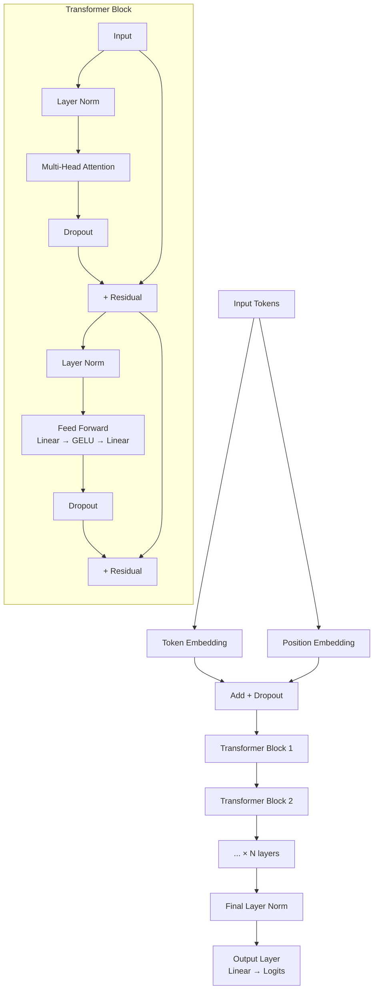

# Model Architecture

```mermaid
graph TB
    Input[Input Tokens] --> TokenEmb[Token Embedding]
    Input --> PosEmb[Position Embedding]
    TokenEmb --> Add1[Add + Dropout]
    PosEmb --> Add1

    Add1 --> TB1[Transformer Block 1]
    TB1 --> TB2[Transformer Block 2]
    TB2 --> TBN[... × N layers]

    subgraph "Transformer Block"
        direction TB
        X[Input] --> LN1[Layer Norm]
        LN1 --> MHA[Multi-Head Attention]
        MHA --> Drop1[Dropout]
        Drop1 --> Res1[+ Residual]
        X --> Res1

        Res1 --> LN2[Layer Norm]
        LN2 --> FF[Feed Forward<br/>Linear → GELU → Linear]
        FF --> Drop2[Dropout]
        Drop2 --> Res2[+ Residual]
        Res1 --> Res2
    end

    TBN --> FinalLN[Final Layer Norm]
    FinalLN --> Output[Output Layer<br/>Linear → Logits]
```
